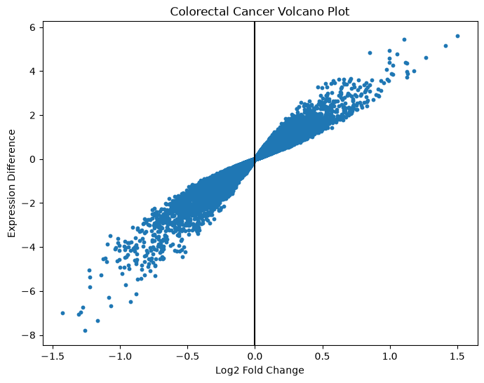

# 🧬 Colorectal Cancer Gene Expression Analysis

## 📌 Project Overview

This project analyzes colorectal cancer gene expression data using Python and publicly available microarray datasets. The objective was to identify genes showing differential expression between healthy and colorectal cancer samples.

## 🎯 Objectives

* Perform gene expression data preprocessing
* Compare healthy and cancer samples
* Calculate differential expression using Log2 Fold Change
* Identify highly upregulated and downregulated genes
* Visualize expression patterns using plots

## 🛠 Tools & Libraries

* Python
* Pandas
* NumPy
* Matplotlib
* Jupyter Notebook

## 📊 Results

The analysis generated:

- Differential expression results for thousands of genes
- Log2 Fold Change calculations
- Volcano plot visualization of expression changes

### Volcano Plot

## 📁 Repository Structure

data/
Raw dataset files

notebooks/
crc_analysis.ipynb

results/
crc_differential_expression.csv

figures/
volcano_plot.png

## 🚀 Key Outcome

Successfully processed colorectal cancer gene expression data and identified genes exhibiting significant expression differences between healthy and cancer samples.

## 👨‍💻 Author

Mohamed Ali Shajith
